

  <picture>
    <source media="(prefers-color-scheme: dark)" srcset="assets/branding/bohanos-logo-horizontal.png">
    <source media="(prefers-color-scheme: light)" srcset="assets/branding/bohanos-logo-horizontal-light.png">
    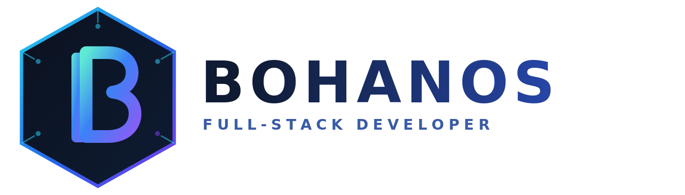
  </picture>

# Hello, I'm Mgboji Chinonso Joshua (Bohanos) 👋

I am a **Full-Stack Web Developer** and **Software Engineer** passionate about building scalable, user-centric web applications. My focus is on creating robust backends with **FastAPI** and dynamic, responsive frontends with **React**.

Beyond the code, I am the creator of **[#BohanosAI]**, where I merge technical development with creative storytelling and AI-assisted design.

---

### 🛠️ Tech Stack

---

### 🚀 Projects

#### 🏥 MedCore Hospital Management System

A full-stack, role-based hospital management system that digitizes day-to-day clinic operations: patient records, appointments, billing, pharmacy, laboratory, staff management and reports, all from one dashboard.

📺 [Watch demo video](https://your-video-link) Video is currently not available (will be done soon) · 📄 [Read the full documentation](docs/MedCore-HMS-Documentation.pdf) · 🔒 Source code private (available on request)

> **Deployment model:** MedCore is built for **on-premise use on a hospital's local network (LAN)**. It is intentionally not publicly hosted, since access is restricted to authenticated staff. The demo video and screenshots below show the full system running with fake data.

*   *Key tech:* React (Vite), Tailwind CSS, FastAPI, PostgreSQL, SQLAlchemy (async), Alembic, JWT + Argon2
*   *Status:* Complete and actively maintained. The documentation is updated whenever the app changes.

**✨ Highlights**

*   **Role-based access control** for 6 roles (Admin, Doctor, Nurse, Receptionist, Pharmacist, Lab Technician), enforced on the backend (HTTP 403), not just hidden in the UI
*   **Patient records** with search, insurance and emergency-contact details, and a tabbed profile (history, appointments, billing, lab results, prescriptions)
*   **Appointments** with a custom-built month calendar and a strict status workflow (only the assigned doctor can confirm or complete a visit)
*   **Billing** with invoices, payments, PDF receipts and refunds, restricted to Admin and Receptionist
*   **Pharmacy** with drug inventory, low-stock alerts that trigger real notifications, and a dispense workflow
*   **Laboratory** with a payment-gated flow: order, payment, result entry, doctor notification and patient email
*   **Reports** on revenue, patients, appointments, stock and lab utilization, exportable to PDF and Excel
*   **Background email delivery** via the hospital's own Gmail mailbox (confirmations, lab results, paid-invoice receipts)
*   **Secure onboarding**: new staff activate their account through an emailed link, with no temporary passwords
*   **Light and dark themes** that switch instantly, without a reload

**🖼️ Screenshots** *(click any image to view it full size)*

<table>
  <tr>
    <td align="center"><a href="assets/hms/01-login.png">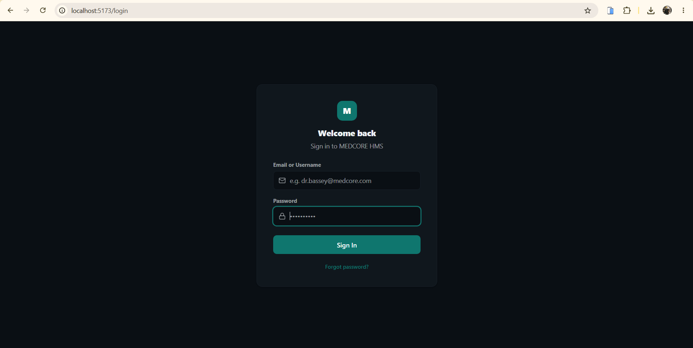</a> Login</td>
    <td align="center"><a href="assets/hms/02-dashboard.png">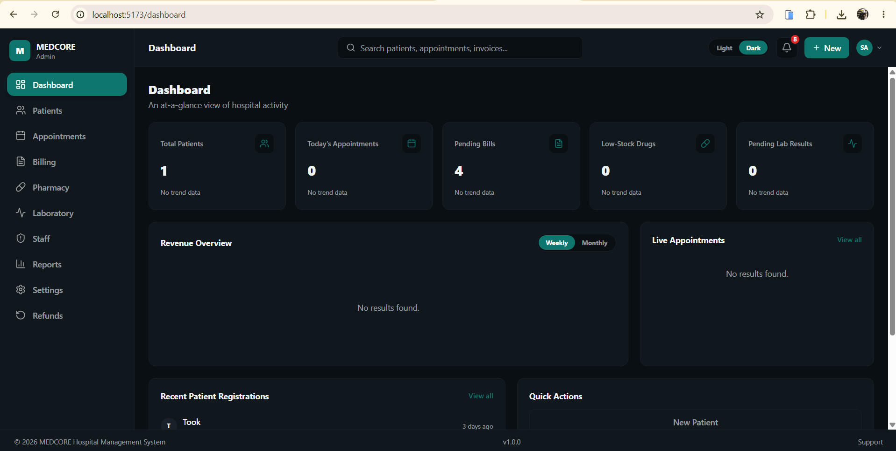</a> Dashboard</td>
    <td align="center"><a href="assets/hms/03-patients.png">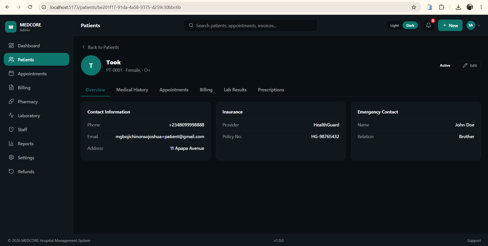</a> Patients</td>
    <td align="center"><a href="assets/hms/04-patient-profile.png">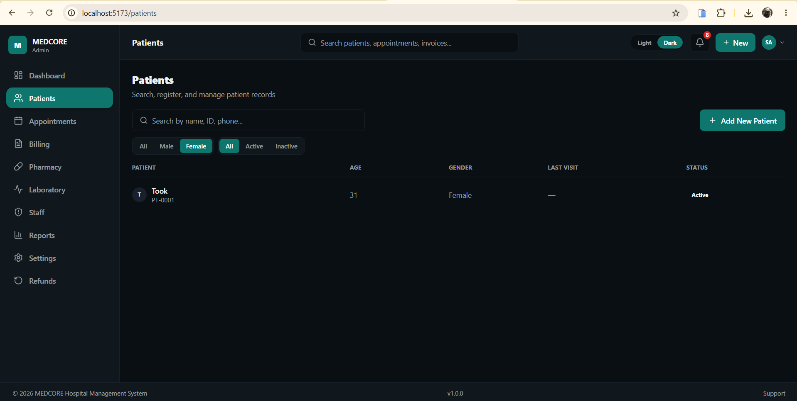</a> Patient Profile</td>
    <td align="center"><a href="assets/hms/05-appointments.png">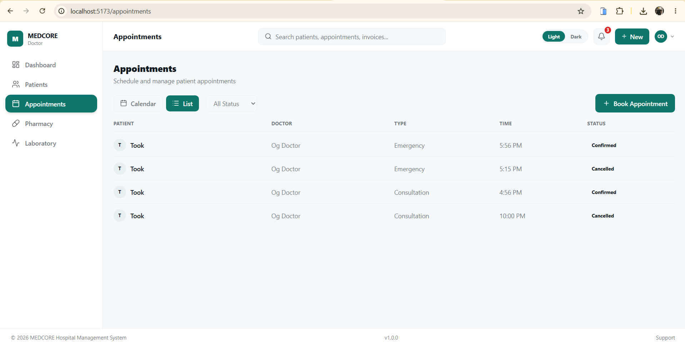</a> Appointments</td>
  </tr>
  <tr>
    <td align="center"><a href="assets/hms/06-billing.png">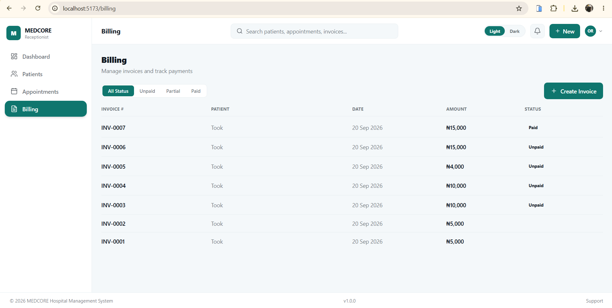</a> Billing</td>
    <td align="center"><a href="assets/hms/07-pharmacy.png">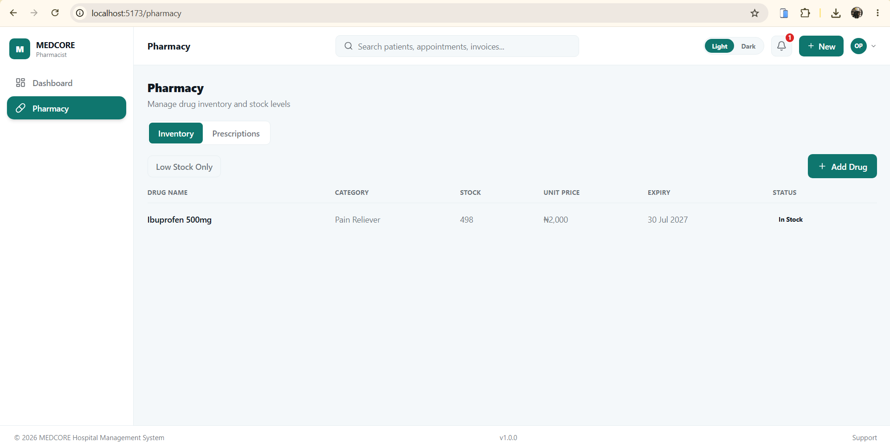</a> Pharmacy</td>
    <td align="center"> Laboratory</td>
    <td align="center"><a href="assets/hms/09-reports.png">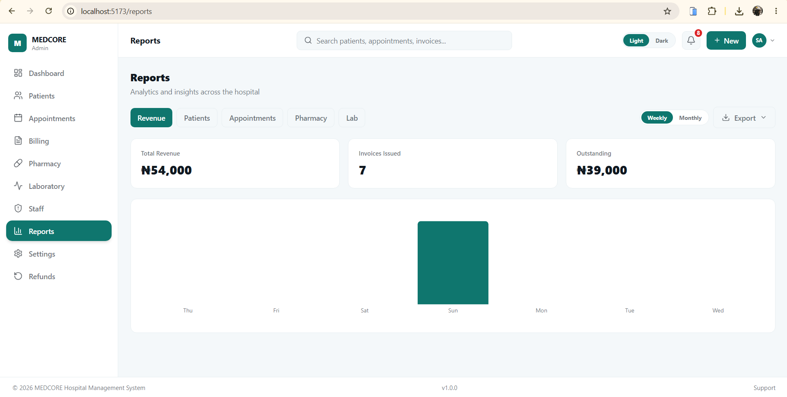</a> Reports</td>
    <td align="center"><a href="assets/hms/10-dark-mode.png">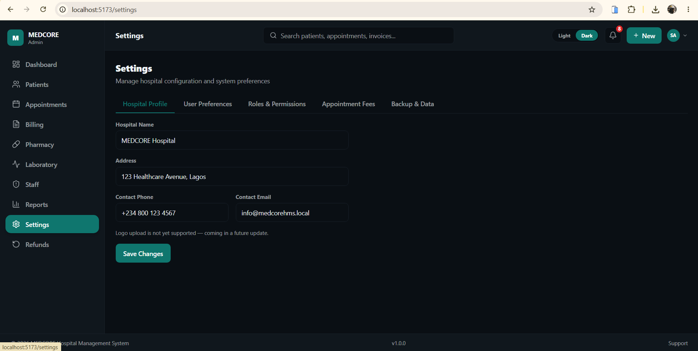</a> Dark Mode</td>
  </tr>
</table>

**🔜 Roadmap (planned, not built yet)**

*   **Clinical records for nurses:** the patient profile has a Medical History tab, currently a placeholder. Planned: nurses will record medical history, family history, observations (vital signs: temperature, pulse, respiration and blood pressure) and health details such as blood group and allergies there. These currently sit on the registration form.
*   **Role changes:** a new Accountant role will take over all billing, including what the Admin controls today. The Receptionist will then focus strictly on booking appointments and recording or updating patient details, not health-related information.

These are previewed at the end of the demo video as upcoming features, not part of the current build. The documentation will be updated once they ship.

---

#### 💈 Berah's Barber Studio

A premium grooming and styling website that showcases professional services and gives clients a seamless booking experience, with a modern, responsive interface.

*   *Key tech:* React
*   *Status:* Live (deployed on Vercel)
*   🌐 [Visit the live site](https://berah-barber-studio.vercel.app/) · 💻 [View the repository](https://github.com/Bohanos/Berah-Barber-Studio)

  <table>
  <tr>
    <td><a href="https://berah-barber-studio.vercel.app/">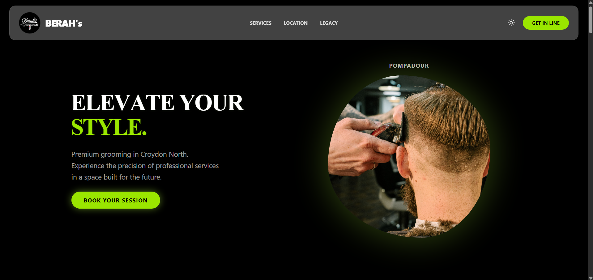</a></td>
    <td><a href="https://berah-barber-studio.vercel.app/">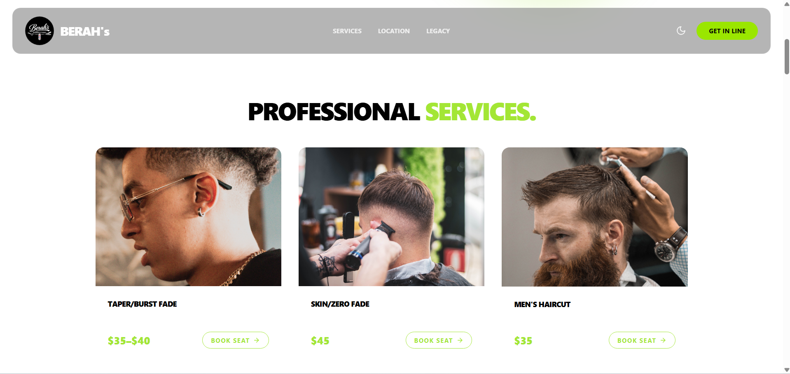</a></td>
  </tr>
</table>

---

#### 🎗️ Macedonian Call Cancer Foundation (Client Project)

A website built for a client NGO that provides community-based cancer care in Abia State, Nigeria. It is fully multilingual (English, Français, Español, Italiano, 中文, 日本語), supports light and dark themes, and includes a donation call to action.

*   *Key tech:* *(add your stack here)*
*   *Status:* 🚧 **In development.** This project is not finished yet, so some content and images are still missing.
*   🌐 [Preview the current version](https://ngo-gules-two.vercel.app/)

---

### 🎨 Creative Corner: BohanosAI
I believe that software development is as much about creativity as it is about logic. Through **BohanosAI**, I explore the intersection of technology and storytelling, developing unique characters and narratives that push the limits of what a "brand" can look like in the developer space.

---

### 📬 Connect With Me

*   **GitHub:** [github.com/Bohanos](https://github.com/Bohanos)
*   **Facebook:** [facebook.com/Chinonso Mgboji](https://www.facebook.com/Bohanos)
*   **Email:** [mgbojichinonsojoshua@gmail.com](mailto:mgbojichinonsojoshua@gmail.com)
*   **Portfolio:** *Coming Soon* — Currently leveling up through an advanced development course to build my official portfolio.
---

> *Currently focused on building, learning, and scaling. Let's connect!*